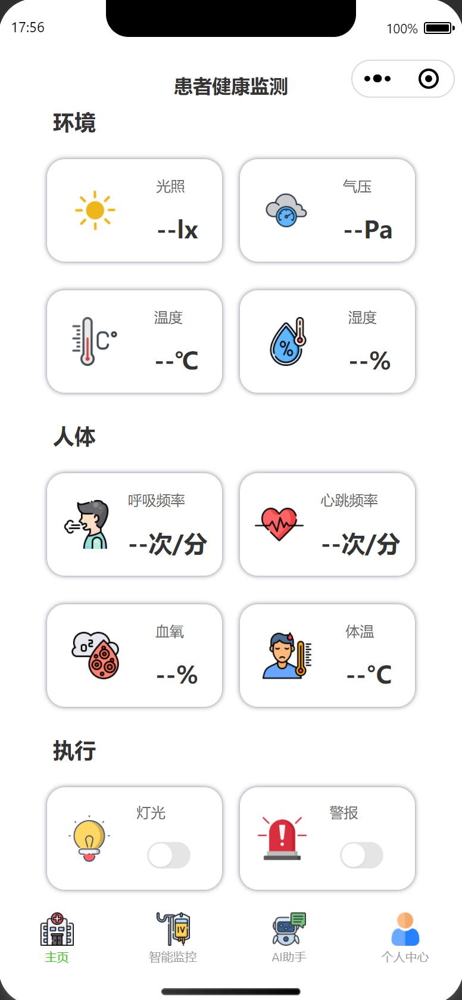
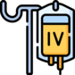

# 🏥 IoT 患者健康监测系统

一个基于 ESP32-S3 硬件和微信小程序的智能健康监测系统，实现实时生理数据采集、AI 健康分析和远程监护功能。

## 🌐 Language / 语言

- [🇨🇳 中文版](README.md)
- [🇺🇸 English](README_EN.md)

## 📱 系统界面展示

<div align="center">
  <table>
    <tr>
      <td align="center" width="25%">
        
        <br/>
        <b>🏠 主页监测界面</b>
        <br/>
        <sub>实时生理指标监测</sub>
      </td>
      <td align="center" width="25%">
        
        <br/>
        <b>💧 智能输液监控</b>
        <br/>
        <sub>输液瓶实时动画监控</sub>
      </td>
      <td align="center" width="25%">
        
        <br/>
        <b>🤖 AI智能助手</b>
        <br/>
        <sub>智能健康分析对话</sub>
      </td>
      <td align="center" width="25%">
        
        <br/>
        <b>👤 个人中心</b>
        <br/>
        <sub>用户信息管理</sub>
      </td>
    </tr>
  </table>
</div>

### 🏠 主页监测界面

实时显示患者的关键生理指标和环境数据：

**人体健康指标：**
- 🫁 **呼吸频率** - 每分钟呼吸次数
- ❤️ **心率监测** - 实时心跳频率
- 🩸 **血氧饱和度** - SpO2 实时监测

**环境监测数据：**
- 🌡️ **环境温度** - 精确到 0.1°C
- 💧 **环境湿度** - 实时湿度跟踪
- ☀️ **光照强度** - 环境光照监测
- 🌪️ **气压监测** - 大气压力实时跟踪

**设备控制：**
- 💡 **设备控制** - LED 灯光和蜂鸣器控制

### 💧 智能输液监控

专业的输液监测功能：

**实时动画监控：**
- 🧪 **输液瓶3D动画** - 高精度24帧液体动画，实时反映液体变化
- 🌊 **波浪效果** - 液体表面自然波浪动画，增强视觉真实感
- ✨ **高光反射** - 瓶身玻璃高光和液体表面反射效果
- 🎭 **阴影渲染** - 立体阴影效果，提升视觉层次感
- 💧 **输液管动画** - 液滴下落动画，模拟真实输液过程

**数据监测：**
- ⚖️ **重量监测** - 实时显示初始重量、当前重量和剩余百分比
- 📊 **智能计算** - 自动计算剩余液体百分比和警告阈值
- 🚨 **低液体警告** - 液体不足时自动触发蜂鸣器警告
- 💉 **输液速度** - 实时监测输液滴速（滴/分钟）
- 📈 **状态判断** - 智能判断输液速度状态（正常/偏慢/过快）

**MQTT数据支持：**
- 📡 **patient/monitor/weight-begin** - 接收初始重量数据
- 📡 **patient/monitor/weight** - 接收实时重量数据
- 📡 **patient/monitor/infusion-speed** - 接收输液速度数据
- 🔄 **数据格式兼容** - 支持字符串和数值格式的数据解析

### 🤖 AI 智能助手

智能健康分析功能：

- 🤖 **专业AI医生** - 基于专业医学提示词的智能诊断
- 📊 **数据分析** - 自动分析健康数据趋势和环境数据
- 🌡️ **环境分析** - 综合评估环境因素对健康的影响
- 💡 **结构化建议** - 按照专业格式提供健康指导：
  - **初步诊断** - 健康状态评估
  - **关联分析** - 人体数据与环境因素关系
  - **健康建议** - 生活方式调整建议
  - **风险预警** - 潜在健康问题提示
- 🚨 **异常提醒** - 智能识别健康风险
- 📝 **历史对话管理** - 完整的对话管理功能，复刻界面效果
  - ✏️ **编辑模式** - 点击"编辑"按钮进入管理模式，支持批量操作
  - 🗑️ **删除对话** - 单个删除或批量清空，带确认对话框防误操作
  - 📌 **置顶对话** - 重要对话置顶显示在专门分组中
  - 🏷️ **重命名对话** - 自定义对话标题，支持实时编辑
  - 🎨 **动画效果** - 侧边栏滑动动画，主界面移动缩放效果
  - 🎯 **智能状态** - 空状态优化显示，编辑按钮智能禁用

### 👤 个人中心

用户管理功能：

- 🔐 **登录验证** - 访问敏感功能前需要先登录
- 👤 **患者信息** - 个人资料管理
- 👨‍⚕️ **医生信息** - 主治医生联系方式
- 👨‍👩‍👧‍👦 **家属联系** - 紧急联系人管理
- ⚙️ **系统设置** - 个性化配置选项

**安全特性：**
- 未登录用户尝试访问敏感功能时会提示先登录
- 登录状态持久化保存，重启应用后自动恢复
- 支持一键退出登录，清除所有本地用户数据

## 🏗️ 系统架构

```
┌─────────────────┐    ┌─────────────────┐    ┌─────────────────┐
│   ESP32-S3      │    │   后端服务器     │    │   微信小程序     │
│   硬件传感器     │◄──►│   Node.js API   │◄──►│   前端界面      │
└─────────────────┘    └─────────────────┘    └─────────────────┘
         │                       │                       │
         │                       │                       │
    ┌────▼────┐             ┌────▼────┐             ┌────▼────┐
    │  MQTT   │             │  MySQL  │             │  Coze   │
    │  消息队列 │             │  数据库  │             │ AI API  │
    └─────────┘             └─────────┘             └─────────┘
```

## 🚀 核心功能

### 📊 实时数据监测

- **多传感器支持**: 体温、湿度、呼吸、血氧等生理指标
- **实时数据传输**: 基于 MQTT 协议的低延迟数据传输
- **历史数据存储**: MySQL 数据库存储完整监测历史
- **数据可视化**: 实时图表和趋势分析

### 🤖 AI 智能分析

- **健康数据分析**: 基于 Coze API 的智能健康评估
- **异常检测**: 自动识别生理指标异常
- **个性化建议**: 根据用户数据提供定制化健康建议
- **实时问答**: 24/7 智能健康咨询服务

### 🔧 设备控制

- **远程控制**: 通过小程序控制硬件设备
- **状态监控**: 实时显示设备运行状态
- **自动化控制**: 基于传感器数据的智能控制

### 👥 用户管理

- **多角色支持**: 患者、医生、家属不同权限
- **信息管理**: 完整的用户资料和联系信息
- **权限控制**: 基于角色的数据访问控制

## 🛠️ 技术栈

### 前端技术

- **微信小程序**: 原生小程序开发框架
- **WXML/WXSS**: 小程序标记语言和样式
- **JavaScript**: ES6+语法，模块化开发
- **WeUI**: 微信官方 UI 组件库

### 后端技术

- **Node.js**: 服务器运行环境
- **Express.js**: Web 应用框架
- **MySQL**: 关系型数据库
- **MQTT**: 物联网消息传输协议
- **Coze API**: AI 对话服务

### 硬件技术

- **ESP32-S3**: 主控芯片
- **WiFi**: 无线网络连接
- **传感器**: DHT22(温湿度)、MAX30102(血氧)等
- **执行器**: LED 灯、蜂鸣器等

## 📁 项目结构

```
LoTProject/
├── 📱 前端小程序
│   ├── pages/                 # 页面文件
│   │   ├── index/            # 主页监测界面
│   │   ├── ai-doctor/        # AI助手页面
│   │   ├── profile/          # 个人中心
│   │   ├── patient-info/     # 患者信息
│   │   ├── doctor-info/      # 医生信息
│   │   └── family-contact/   # 家属联系
│   ├── utils/                # 工具函数
│   │   ├── ai.js            # AI助手工具
│   │   ├── mqtt.js          # MQTT通信
│   │   └── util.js          # 通用工具
│   ├── images/              # 图片资源
│   ├── config/              # 配置文件
│   ├── app.js              # 小程序入口
│   └── app.json            # 小程序配置
├── 🖥️ 后端服务
│   ├── server/
│   │   ├── app.js          # 服务器入口
│   │   ├── config/         # 数据库配置
│   │   └── sql/            # SQL脚本
│   └── database/           # 数据库文件
├── 📜 脚本工具
│   └── scripts/            # 部署和启动脚本
└── 📚 文档
    ├── README.md           # 项目说明
    └── package.json        # 依赖配置
```

## ⚙️ 环境配置

### 系统要求

- **Node.js**: >= 16.0.0
- **MySQL**: >= 5.7
- **微信开发者工具**: 最新版本
- **ESP32-S3 开发板**: 支持 WiFi 功能

### 环境变量配置

创建 `.env` 文件：

```env
# 数据库配置
DB_HOST=localhost
DB_PORT=3306
DB_USER=root
DB_PASSWORD=your_password
DB_NAME=iot_monitor

# MQTT配置
MQTT_HOST=your_mqtt_broker
MQTT_PORT=1883
MQTT_USERNAME=your_username
MQTT_PASSWORD=your_password

# AI配置
COZE_API_KEY=your_coze_api_key
COZE_BOT_ID=your_bot_id
```

## 🚀 快速开始

### 1. 克隆项目

```bash
git clone https://github.com/your-username/iot-health-monitor.git
cd iot-health-monitor
```

### 2. 安装依赖

```bash
npm install
```

### 3. 数据库初始化

```bash
# 创建数据库
mysql -u root -p -e "CREATE DATABASE iot_monitor;"

# 导入数据库结构
mysql -u root -p iot_monitor < database/init.sql
```

### 4. 启动后端服务

```bash
# 开发模式
npm run dev

# 生产模式
npm start
```

### 5. 配置小程序

1. 使用微信开发者工具打开项目
2. 配置服务器域名（开发时可关闭域名校验）
3. 配置 Coze API 密钥
4. 编译并预览

## 📊 API 接口

### 传感器数据接口

```javascript
// 接收硬件端数据
POST /api/sensor-data
{
  "device_id": "esp32_001",
  "temp": 36.5,
  "humi": 65.0,
  "breathing": 18,
  "spo2": 98
}

// 获取最新数据
GET /api/latest/:deviceId

// 获取历史数据
GET /api/history/:deviceId?limit=50&page=1
```

### 系统状态接口

```javascript
// 健康检查
GET /api/health

// 设备状态
GET /api/device-status/:deviceId
```

## 🔧 硬件端数据格式

系统完全兼容 ESP32-S3 硬件端的数据格式：

```json
{
  "device_id": "data_send_test_01",
  "temp": 37.2, // 体温 (°C)
  "humi": 65.5, // 湿度 (%)
  "breathing": 18, // 呼吸频率 (次/分)
  "spo2": 97, // 血氧饱和度 (%)
  "heart": 72 // 心率 (次/分，预留)
}
```

## 🙏 致谢

感谢以下开源项目和服务：

- [Node.js](https://nodejs.org/)
- [MySQL](https://www.mysql.com/)
- [微信小程序](https://developers.weixin.qq.com/miniprogram/dev/framework/)
- [Coze AI](https://www.coze.cn/)

---

⭐ 如果这个项目对您有帮助，请给我们一个星标！
