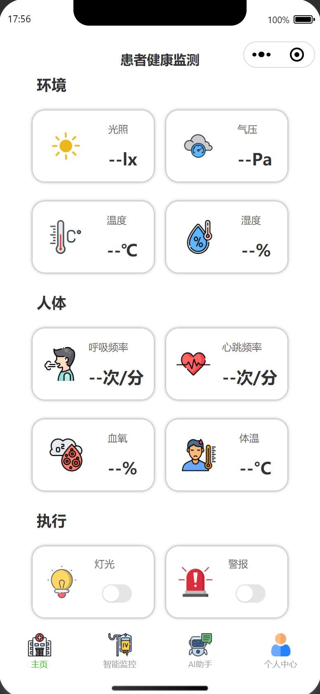
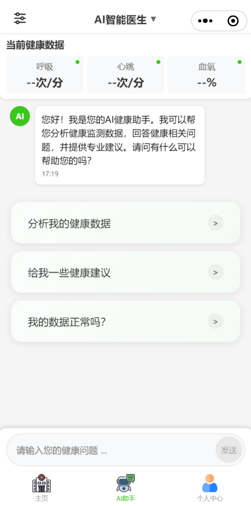
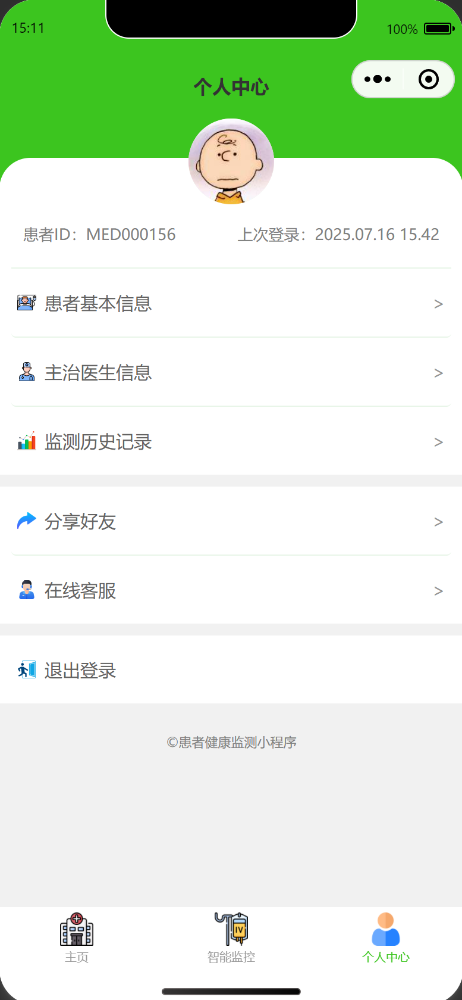

# 🏥 IoT Patient Health Monitoring System

An intelligent health monitoring system based on ESP32-S3 hardware and WeChat Mini Program, enabling real-time physiological data collection, AI health analysis, and remote monitoring capabilities.

## 🌐 Language / 语言

- [🇨🇳 中文版](README.md)
- [🇺🇸 English](README_EN.md)

## 📱 System Interface Display

<div align="center">
  <table>
    <tr>
      <td align="center" width="33%">
        
        <br/>
        <b>🏠 Home Monitoring</b>
        <br/>
        <sub>Real-time Physiological Monitoring</sub>
      </td>
      <td align="center" width="33%">
        
        <br/>
        <b>🤖 AI Assistant</b>
        <br/>
        <sub>Intelligent Health Analysis</sub>
      </td>
      <td align="center" width="33%">
        
        <br/>
        <b>👤 User Profile</b>
        <br/>
        <sub>User Information Management</sub>
      </td>
    </tr>
  </table>
</div>

### 🏠 Home Monitoring Interface

Real-time display of patient's key physiological indicators:

- 🌡️ **Temperature Monitoring** - Accurate to 0.1°C
- 💧 **Humidity Monitoring** - Real-time environmental humidity tracking
- 🫁 **Breathing Rate** - Breaths per minute
- 🩸 **Blood Oxygen Saturation** - Real-time SpO2 monitoring
- 💡 **Device Control** - LED lighting and buzzer control

### 🤖 AI Intelligent Assistant

Smart health analysis features:

- 🤖 **Real-time Conversation** - Intelligent Q&A based on Coze API
- 📊 **Data Analysis** - Automatic health data trend analysis
- 💡 **Health Recommendations** - Personalized health guidance
- 🚨 **Abnormal Alerts** - Intelligent health risk identification

### 👤 User Profile

User management features:

- 👤 **Patient Information** - Personal profile management
- 👨‍⚕️ **Doctor Information** - Attending physician contact details
- 👨‍👩‍👧‍👦 **Family Contacts** - Emergency contact management
- ⚙️ **System Settings** - Personalized configuration options

## 🏗️ System Architecture

```
┌─────────────────┐    ┌─────────────────┐    ┌─────────────────┐
│   ESP32-S3      │    │   Backend       │    │   WeChat Mini   │
│   Hardware      │◄──►│   Node.js API   │◄──►│   Program       │
│   Sensors       │    │   Server        │    │   Frontend      │
└─────────────────┘    └─────────────────┘    └─────────────────┘
         │                       │                       │
         │                       │                       │
    ┌────▼────┐             ┌────▼────┐             ┌────▼────┐
    │  MQTT   │             │  MySQL  │             │  Coze   │
    │ Message │             │Database │             │ AI API  │
    │  Queue  │             │         │             │         │
    └─────────┘             └─────────┘             └─────────┘
```

## 🚀 Core Features

### 📊 Real-time Data Monitoring

- **Multi-sensor Support**: Temperature, humidity, breathing, blood oxygen and other physiological indicators
- **Real-time Data Transmission**: Low-latency data transmission based on MQTT protocol
- **Historical Data Storage**: Complete monitoring history stored in MySQL database
- **Data Visualization**: Real-time charts and trend analysis

### 🤖 AI Intelligent Analysis

- **Health Data Analysis**: Intelligent health assessment based on Coze API
- **Anomaly Detection**: Automatic identification of physiological indicator abnormalities
- **Personalized Recommendations**: Customized health advice based on user data
- **Real-time Q&A**: 24/7 intelligent health consultation service

### 🔧 Device Control

- **Remote Control**: Control hardware devices through mini program
- **Status Monitoring**: Real-time display of device operating status
- **Automated Control**: Intelligent control based on sensor data

### 👥 User Management

- **Multi-role Support**: Different permissions for patients, doctors, and family members
- **Information Management**: Complete user profiles and contact information
- **Access Control**: Role-based data access control

## 🛠️ Technology Stack

### Frontend Technologies

- **WeChat Mini Program**: Native mini program development framework
- **WXML/WXSS**: Mini program markup language and styles
- **JavaScript**: ES6+ syntax, modular development
- **WeUI**: Official WeChat UI component library

### Backend Technologies

- **Node.js**: Server runtime environment
- **Express.js**: Web application framework
- **MySQL**: Relational database
- **MQTT**: IoT message transmission protocol
- **Coze API**: AI conversation service

### Hardware Technologies

- **ESP32-S3**: Main control chip
- **WiFi**: Wireless network connection
- **Sensors**: DHT22 (temperature/humidity), MAX30102 (blood oxygen), etc.
- **Actuators**: LED lights, buzzers, etc.

## 📁 Project Structure

```
LoTProject/
├── 📱 Frontend Mini Program
│   ├── pages/                 # Page files
│   │   ├── index/            # Home monitoring interface
│   │   ├── ai-doctor/        # AI assistant page
│   │   ├── profile/          # User profile
│   │   ├── patient-info/     # Patient information
│   │   ├── doctor-info/      # Doctor information
│   │   └── family-contact/   # Family contacts
│   ├── utils/                # Utility functions
│   │   ├── ai.js            # AI assistant tools
│   │   ├── mqtt.js          # MQTT communication
│   │   └── util.js          # Common utilities
│   ├── images/              # Image resources
│   ├── config/              # Configuration files
│   ├── app.js              # Mini program entry
│   └── app.json            # Mini program configuration
├── 🖥️ Backend Service
│   ├── server/
│   │   ├── app.js          # Server entry
│   │   ├── config/         # Database configuration
│   │   └── sql/            # SQL scripts
│   └── database/           # Database files
├── 📜 Script Tools
│   └── scripts/            # Deployment and startup scripts
└── 📚 Documentation
    ├── README.md           # Project documentation (Chinese)
    ├── README_EN.md        # Project documentation (English)
    └── package.json        # Dependency configuration
```

## ⚙️ Environment Configuration

### System Requirements

- **Node.js**: >= 16.0.0
- **MySQL**: >= 5.7
- **WeChat Developer Tools**: Latest version
- **ESP32-S3 Development Board**: WiFi support required

### Environment Variables Configuration

Create `.env` file:

```env
# Database Configuration
DB_HOST=localhost
DB_PORT=3306
DB_USER=root
DB_PASSWORD=your_password
DB_NAME=iot_monitor

# MQTT Configuration
MQTT_HOST=your_mqtt_broker
MQTT_PORT=1883
MQTT_USERNAME=your_username
MQTT_PASSWORD=your_password

# AI Configuration
COZE_API_KEY=your_coze_api_key
COZE_BOT_ID=your_bot_id
```

## 🚀 Quick Start

### 1. Clone Repository

```bash
git clone https://github.com/your-username/iot-health-monitor.git
cd iot-health-monitor
```

### 2. Install Dependencies

```bash
npm install
```

### 3. Database Initialization

```bash
# Create database
mysql -u root -p -e "CREATE DATABASE iot_monitor;"

# Import database structure
mysql -u root -p iot_monitor < database/init.sql
```

### 4. Start Backend Service

```bash
# Development mode
npm run dev

# Production mode
npm start
```

### 5. Configure Mini Program

1. Open project with WeChat Developer Tools
2. Configure server domain (disable domain verification for development)
3. Configure Coze API key
4. Compile and preview

## 📊 API Interfaces

### Sensor Data Interfaces

```javascript
// Receive hardware data
POST /api/sensor-data
{
  "device_id": "esp32_001",
  "temp": 36.5,
  "humi": 65.0,
  "breathing": 18,
  "spo2": 98
}

// Get latest data
GET /api/latest/:deviceId

// Get historical data
GET /api/history/:deviceId?limit=50&page=1
```

### System Status Interfaces

```javascript
// Health check
GET /api/health

// Device status
GET /api/device-status/:deviceId
```

## 🔧 Hardware Data Format

The system is fully compatible with ESP32-S3 hardware data format:

```json
{
  "device_id": "data_send_test_01",
  "temp": 37.2, // Temperature (°C)
  "humi": 65.5, // Humidity (%)
  "breathing": 18, // Breathing rate (breaths/min)
  "spo2": 97, // Blood oxygen saturation (%)
  "heart": 72 // Heart rate (bpm, reserved)
}
```

---

⭐ If this project helps you, please give us a star!
